# End-to-End Azure Data Engineering Project — COVID-19 Reporting

**Technologies:** Azure Data Factory (ADF v2), Mapping Data Flows, Azure Blob / ADLS, HTTP connector, ARM templates.

---

## Project Overview
This repository contains an end-to-end Azure Data Factory ETL pipeline built to ingest, transform, and load COVID-19 data for reporting. The solution demonstrates typical cloud data engineering patterns: parameterized pipelines, dataflow transformations, lookups, pivoting and joins, and exportable ARM templates for full deployment.

---

## What’s included
- `ARMTemplateForFactory.json` & `ARMTemplateParametersForFactory.json` — full ARM templates to deploy the factory and assets.  
- `/factory` folder — exported JSON definitions for pipelines, datasets, dataflows, linked services.  
- `/linkedTemplates` — nested templates used by the main ARM template.  
- Screenshots and architecture diagram (see `/images` folder).

---

## Architecture (summary)
1. **Ingestion**  
   - Sources: HTTP endpoint (public ECDC/case data) and Blob/ADLS storage.  
   - Files ingested using HTTP & Blob datasets and Copy activity.

2. **Orchestration**  
   - Parameterized Pipeline `pl_ingest_ecdc_data` runs a Lookup for file list, ForEach over files, and calls the Copy activity.  
   - Pipelines are parameterized to be reusable across feeds.

3. **Transformation (Mapping Data Flow)**  
   - Source → Filter (FilterEuropeOnly) → Select (SelectOnlyRequiredFields) → Pivot (PivotCounts) → Lookup (country metadata) → Final select & sink.  
   - Transformations used: Filter, Select, Derived Column (rename/format date), Pivot, Join/Lookup, Sort.

4. **Sink**  
   - Transformed data loaded to ADLS / Delta / parquet (see dataset definitions in `/factory`).

---

## How to deploy
1. In Azure Portal, go to **Deploy a custom template** (or use Azure CLI/PowerShell).  
2. Upload `ARMTemplateForFactory.json` and `ARMTemplateParametersForFactory.json`.  
3. Provide parameter values (factory name, region, storage account names).  
4. Validate and create.

---

##  Architecture Overview  
Below is the end-to-end architecture of the Azure Data Factory ETL pipeline used for COVID-19 reporting.

### 🌐 Data Factory Overview
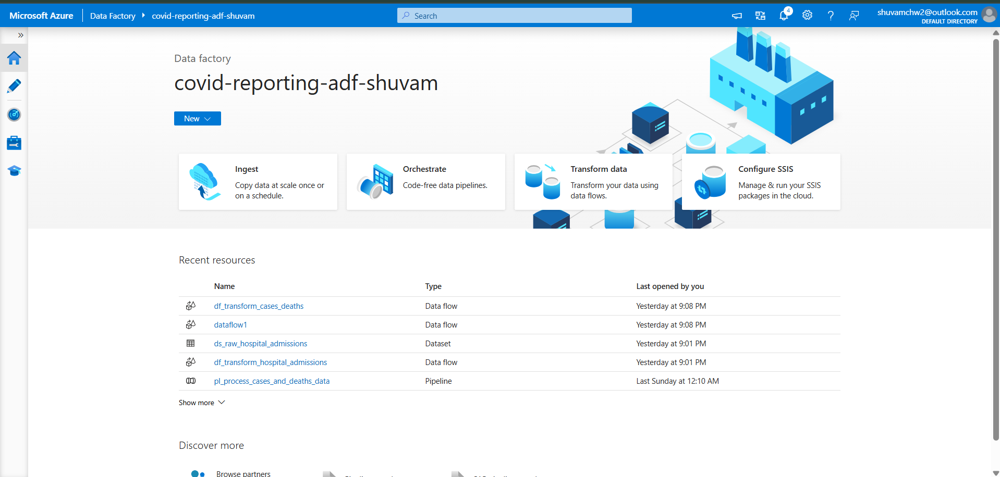

---

## 🔗 Linked Services

### 🔹 Linked Services List 
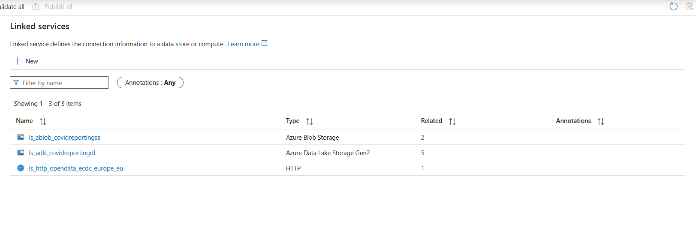

### 🔹 HTTP Linked Service  
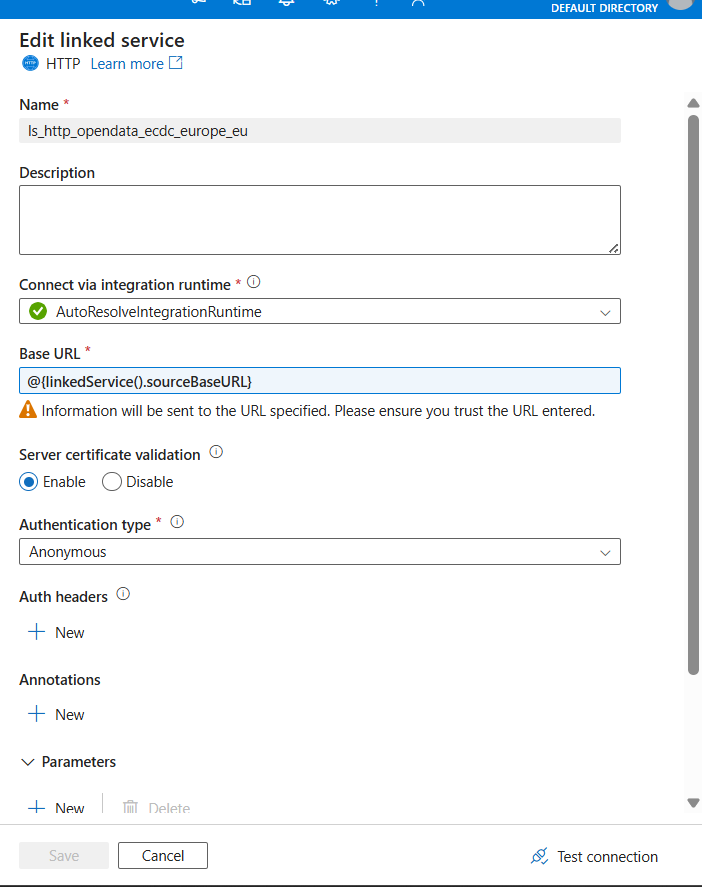

---

## 📁 Datasets  

### 🔹 Dataset List  
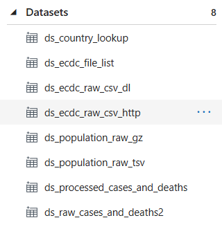

### 🔹 Raw CSV (HTTP Source)
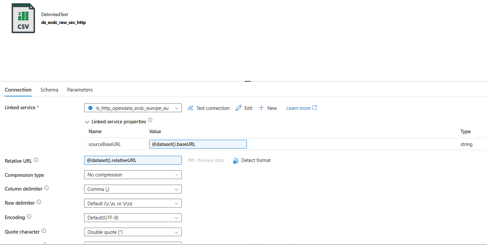

### 🔹 Raw CSV (Download Path Source)
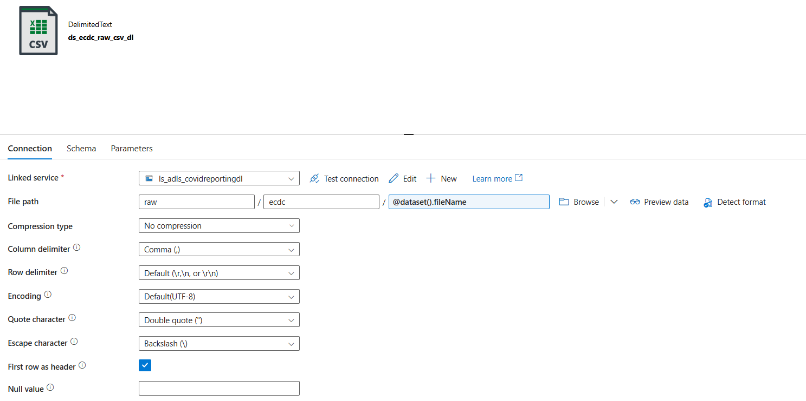

### 🔹 File List Dataset  
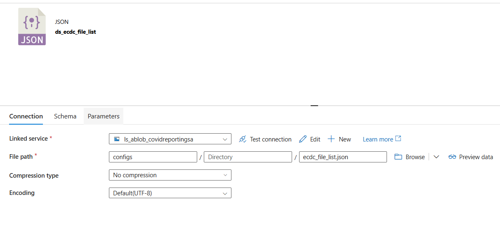

### 🔹 Country Lookup Dataset
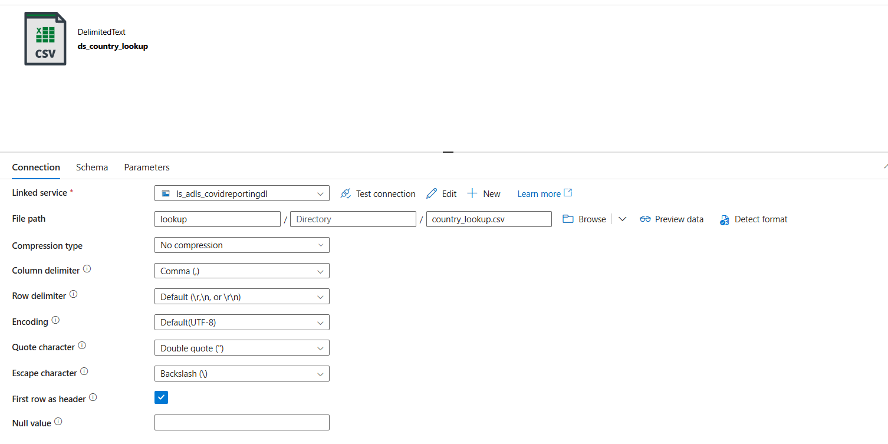

---

## 🔄 Pipelines  

### 🔹 Pipeline List  
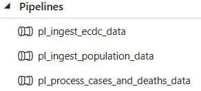

### 🔹 Pipeline: Ingest ECDC Data  
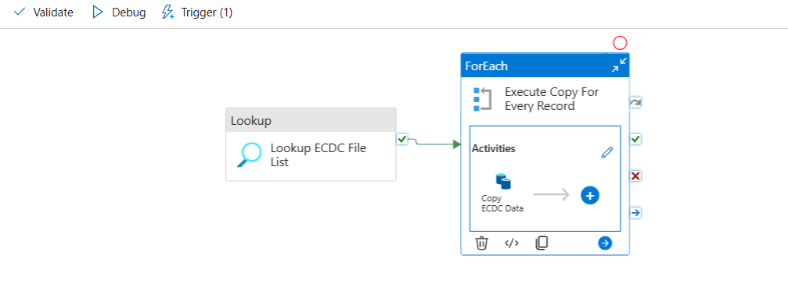

### 🔹 Pipeline: Ingest Population Data  
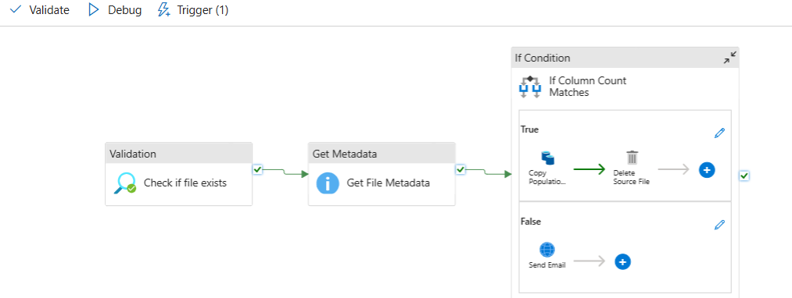

### 🔹 Pipeline: Process Cases & Deaths  
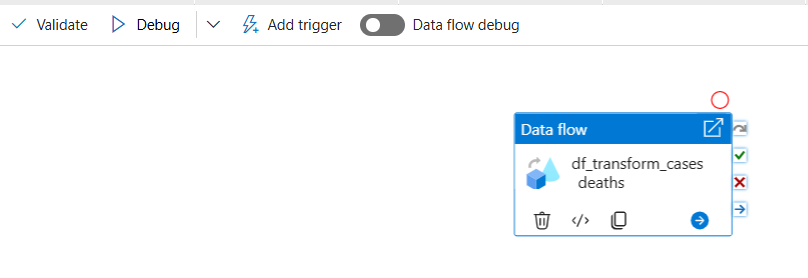

---

## 🧪 Dataflows  

### 🔹 Source (Dataflow)
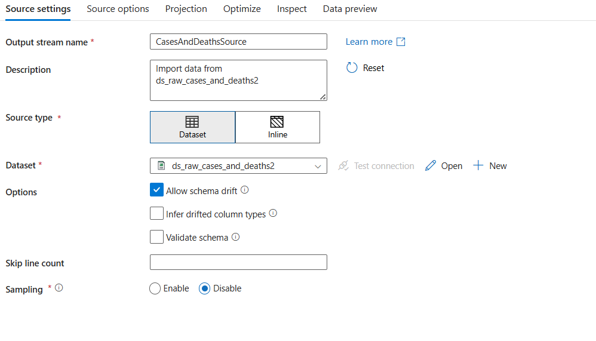

### 🔹 Filter Transform  
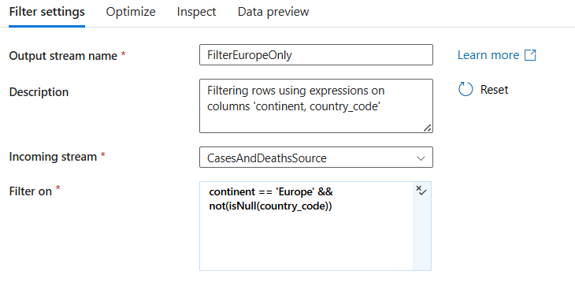

### 🔹 Select Transform  
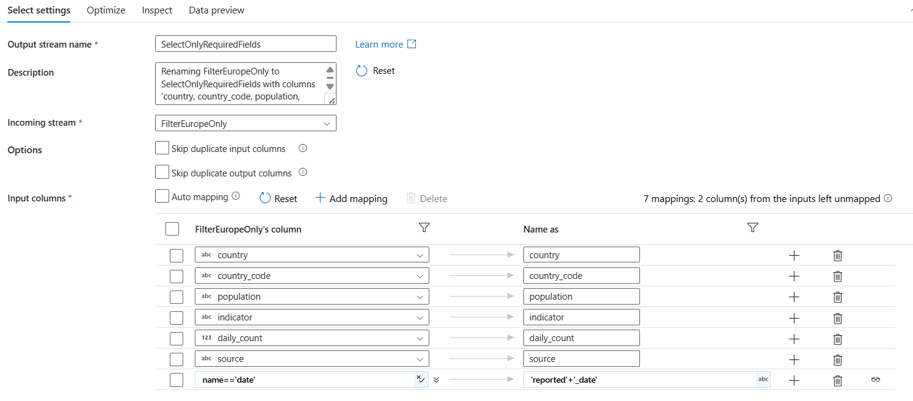

### 🔹 Pivot Transform  
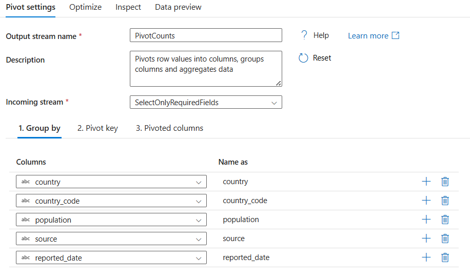

### 🔹 Lookup Transform  
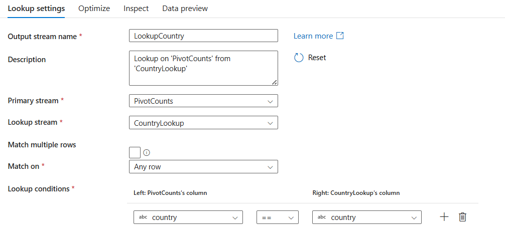

### 🔹 Sink Transform  
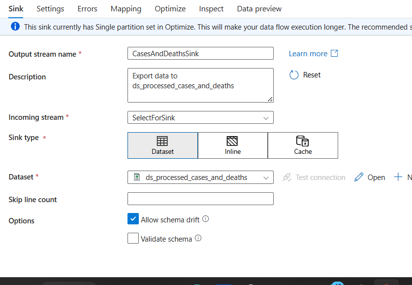

### 🔹 Dataflow Debug Output  
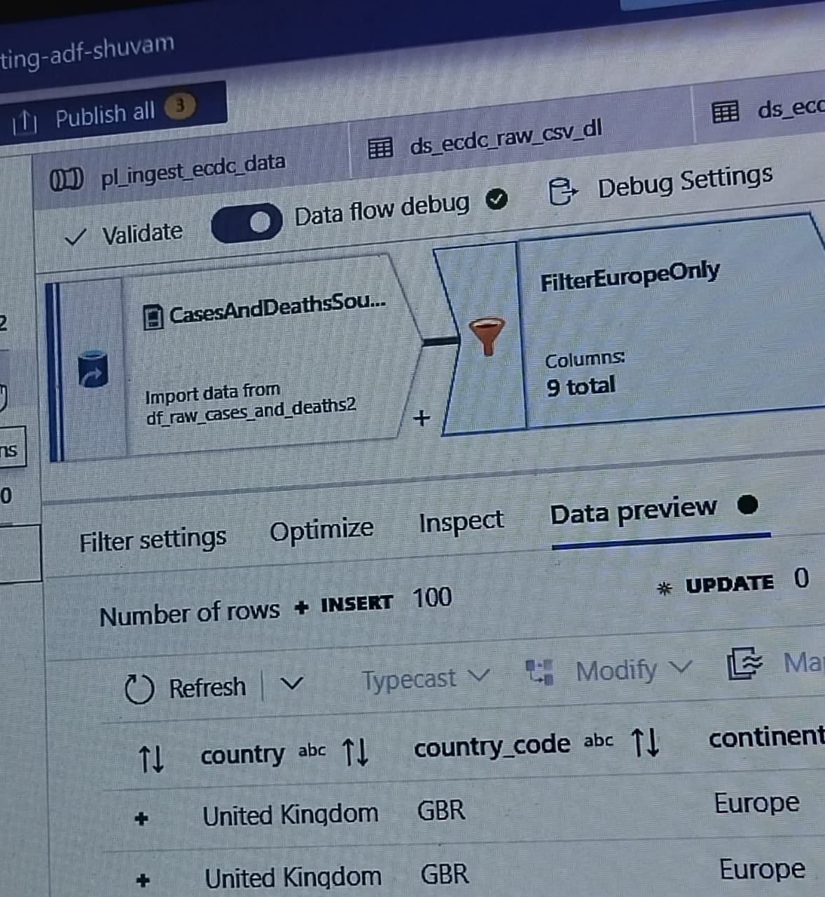

---

